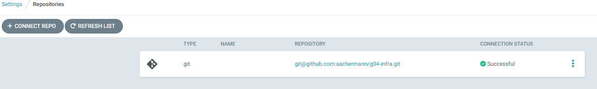
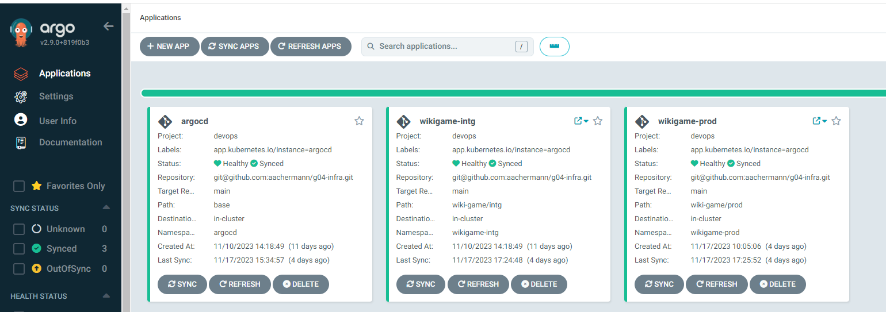
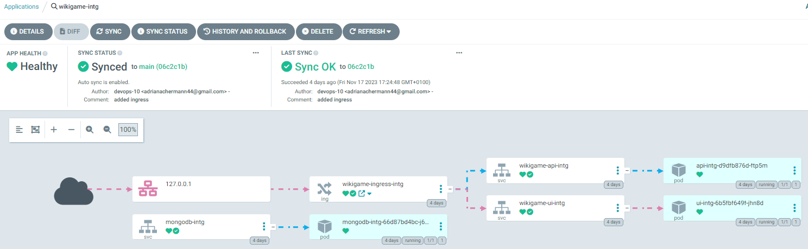

## Installation of ArgoCD
Ressources from https://github.com/argoproj/argo-cd/

### Apply CustomRessourceDefinitions

There are some Manifests, we have to apply. 
In the [install folder](./install/) there is the whole manifest for the ArgoCD installation.

```bash
kubectl create namespace argocd
kubectl apply -f install/crd_argocd.yaml -n argocd
kubectl patch svc argocd-server -p '{"spec": {"type": "NodePort"}}' -n argocd
kubectl get svc -n argocd
kubectl describe svc argocd-server -n argocd | grep NodePort
kubectl get secrets argocd-initial-admin-secret -o yaml -n argocd
echo "Secret from above" | base64 -d
kubectl get secrets argocd-initial-admin-secret -o jsonpath="{.data.password}"  -n argocd| base64 --decode ; echo
```

On students workstation
```bash
ssh -L 8080:localhost:31915 student@devops-10
```

Browser:
https://localhost:8080/
user: admin password: decrypted_password

### Adding Github as Repo

ArgoCD needs access to a git repo. we can configure ssh connection to github.




### AppProjects
Projects provide a logical grouping of applications, which is useful when Argo CD is used by multiple teams.

To simplify matters, we have created only one AppProject in which all applications are listed.
```bash
apiVersion: argoproj.io/v1alpha1
kind: AppProject
metadata:
  name: devops
spec:
  orphanedResources:
    warn: false
  description: devops project
  sourceRepos:
    - "git@github.com:aachermann/g04-infra.git"
  destinations:
    - namespace: "wikigame-prod"
      server: https://kubernetes.default.svc
    - namespace: "wikigame-intg"
      server: https://kubernetes.default.svc
    - namespace: "argocd"
      server: https://kubernetes.default.svc
    - namespace: "default"
      server: https://kubernetes.default.svc
```

### Application

The Application CRD is the Kubernetes resource object representing a deployed application instance in an environment. It is defined by two key pieces of information:
1. source:
*   reference to the desired state in Git 
2. destination
* reference to the target cluster and namespace

#### ArgoCD Application

If there are changes in the [ArgoCD Repo](base) it will sync it self. (that's pretty cool :))

```bash
apiVersion: argoproj.io/v1alpha1
kind: Application
metadata:
    name: argocd
spec:
    destination:
    namespace: argocd
    server: "https://kubernetes.default.svc"
    source:
    path: base
    repoURL: "git@github.com:aachermann/g04-infra.git"
    targetRevision: main
    project: devops
    syncPolicy:
    automated:
        prune: true
        selfHeal: true
```

#### WikiGame Applications

Same Code with Source <-> Destination for our WikiGame

```bash
apiVersion: argoproj.io/v1alpha1
kind: Application
metadata:
    name: wikigame-intg
spec:
    destination:
    namespace: "wikigame-intg"
    server: "https://kubernetes.default.svc"
    source:
    path: wiki-game/intg
    repoURL: "git@github.com:aachermann/g04-infra.git"
    targetRevision: main
    project: devops
    syncPolicy:
    automated:
        prune: true
        selfHeal: true
```

**!!**
on prod stage, we disabled automated!

This means that you have to trigger the sync manually.
```bash 
automated:
    prune: true
    selfHeal: true
```




A synced Application could look like this:

There are several views - each with its own information about the status of the deployed application.