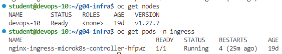
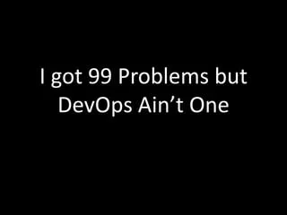

## Installation of microk8s (Micro-Kubernetes - SingleNode-Kubernetes)
https://microk8s.io/
```bash
ssh student@86.119.42.170

# Install Snap
sudo apt install snapd

# Install MK8S
sudo snap install microk8s --classic
echo $USER
sudo usermod -a -G microk8s $USER
sudo chown -f -R $USER ~/.kube
su - $USER
microk8s status --wait-ready

# Check Installation
microk8s kubectl get nodes
microk8s kubectl get services

# a useful alias
echo 'alias kubectl="microk8s kubectl"' >> ~/.bashrc
source ~/.bashrc

# export kubeconfig
mkdir -p ~/.kube/config/
microk8s config > ~/.kube/config/config
export KUBECONFIG=~/.kube/config/config
kubectl config get-contexts

# make cluster available from outside
microk8s enable ingress
kubectl get pods -n ingress

```


wow - kubernetes in 2 sec 




### Kubectl-neat
https://github.com/itaysk/kubectl-neat

*Remove clutter from Kubernetes manifests to make them more readable.*

```bash
# Installing kubectl-neat Tool to make the work easyier
wget https://github.com/itaysk/kubectl-neat/releases/download/v2.0.3/kubectl-neat_linux_amd64.tar.gz
tar -xvzf kubectl-neat_linux_amd64.tar.gz
sudo install -m 755 kubectl-neat /usr/local/bin/kubectl-neat
rm -r kubectl-neat_linux_amd64.tar.gz
rm -r kubectl-neat
rm LICENSE
```
