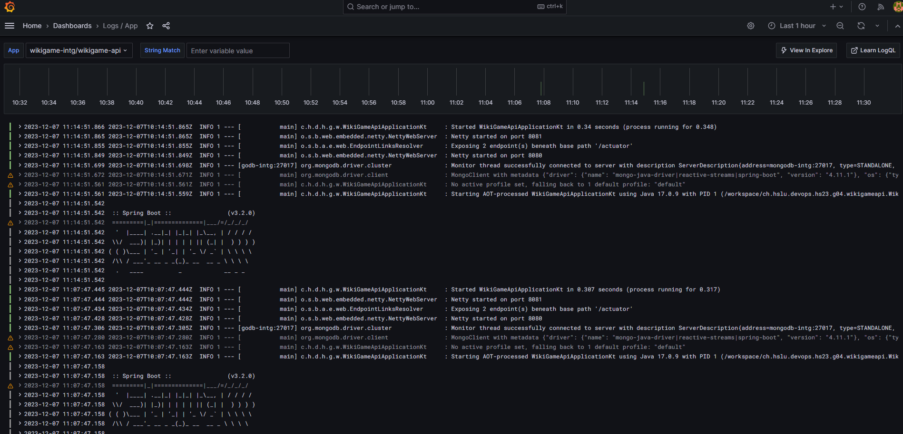
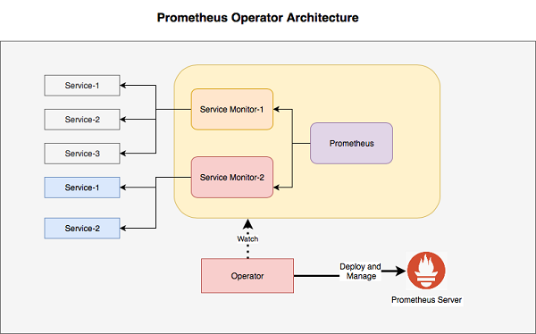
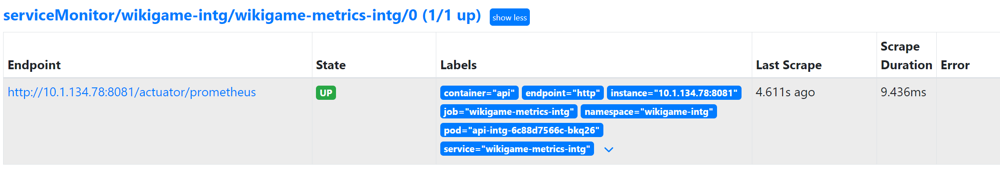
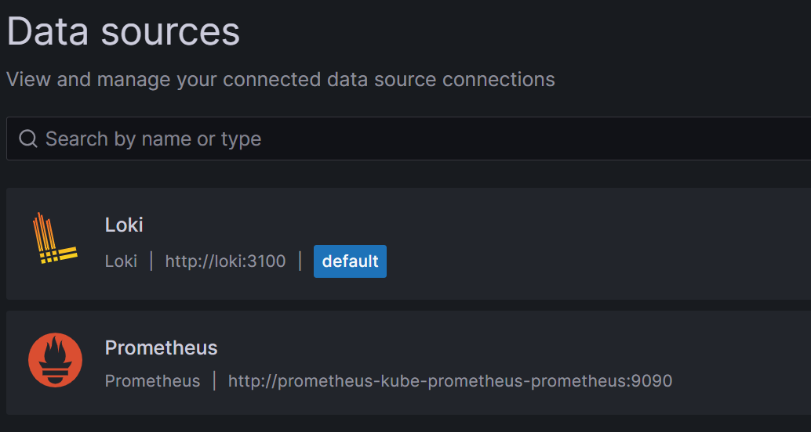

## Installing and Configure Monitoring-Stack

### Installing Helm
```bash
curl -fsSL -o get_helm.sh https://raw.githubusercontent.com/helm/helm/main/scripts/get-helm-3
chmod 700 get_helm.sh
./get_helm.sh
rm get_helm.sh
```

### Adding Helm-Repo

```bash
helm repo add grafana https://grafana.github.io/helm-charts
helm repo update
```

### Loki

```bash
helm template loki grafana/loki-stack --namespace monitoring > monitoring/loki.yaml
```

### Prometheus und Grafana
```bash
helm install prometheus prometheus-community/kube-prometheus-stack --namespace monitoring
kubectl get secret --namespace monitoring prometheus-grafana -o jsonpath="{.data.admin-password}" | base64 --decode ; echo
```


### Namespace

```bash
kubectl create namespace monitoring
```


### Sync ArgoCD

```bash
kubectl get secrets -n monitoring grafana -o jsonpath="{.data.admin-password}" | base64 --decode ; echo
```

### Settings
Login http://monitoring.devops
#### Loki


Application-Logs


#### ServiceMonitor

Our Api-Pod exposes metrics on Port 8081. With the installed Prometheus Operator it is very easy to configure the ScrapeConfig - this means that the Metrics getting into the Prometheus and further to Grafana. We have to configure a ServiceMonitor which point to the Service for the Metrics.



[Quelle](https://www.alibabacloud.com/blog/kubernetes-cluster-monitoring-using-prometheus_594722)


```bash
apiVersion: monitoring.coreos.com/v1
kind: ServiceMonitor
metadata:
  name: wikigame-metrics
  labels:
    release: prometheus
spec:
  selector:
    matchLabels:
      app: wikigame-api
  endpoints:
  - port: http
    path: /actuator/prometheus
```
**Important is the matchLabel - this must match with the Labels on the Service!**

The Endpont says where to scrape all the Metrics

```bash
apiVersion: v1
kind: Service
metadata:
  name: wikigame-metrics
  labels:
    app: wikigame-api
spec:
  type: ClusterIP
  selector:
    app: wikigame-api
  ports:
    - name: http
      protocol: TCP
      port: 8081
      targetPort: 8081
```

On the Prometheus we see the Target automatic with no further configuration:


to use Prometheus Metrics in Grafana you just have to add a new Datasource.
