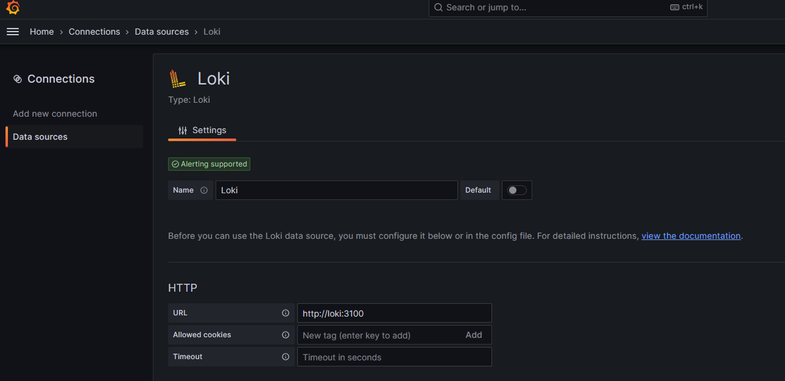

## Installing Grafana and Loki

### Installing Helm
```bash
curl -fsSL -o get_helm.sh https://raw.githubusercontent.com/helm/helm/main/scripts/get-helm-3
chmod 700 get_helm.sh
./get_helm.sh
rm get_helm.sh
```

### Adding Helm-Repo

```bash
helm repo add grafana https://grafana.github.io/helm-charts
helm repo update
```

### Loki

```bash
helm template loki grafana/loki-stack --namespace monitoring > monitoring/loki.yaml
```

### Prometheus und Grafana
```bash
helm install prometheus prometheus-community/kube-prometheus-stack --namespace monitoring
kubectl get secret --namespace monitoring prometheus-grafana -o jsonpath="{.data.admin-password}" | base64 --decode ; echo
```

### Namespace

```bash
kubectl create namespace monitoring
```


### Sync ArgoCD

```bash
kubectl get secrets -n monitoring grafana -o jsonpath="{.data.admin-password}" | base64 --decode ; echo
```

### Settings
Login http://monitoring.devops
#### Loki


