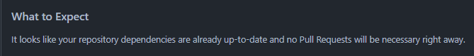

## Adding Renovate to GitHub Repo

We thought it would be cool to run the Renovate in an infrastructure repo.
If there is enough time, we want to update the images automatically with Renovate.

https://github.com/apps/renovate


it creates the [renovate.json](renovate.json)
```bash
{
  "$schema": "https://docs.renovatebot.com/renovate-schema.json",
  "extends": [
    "config:recommended"
  ]
}
```

the renovate bot als open a PullRequest:
https://github.com/aachermann/g04-infra/pull/1


Most useful is the "What to Expect"-Part. There would be a list of dependencies which of the renovate would update.


