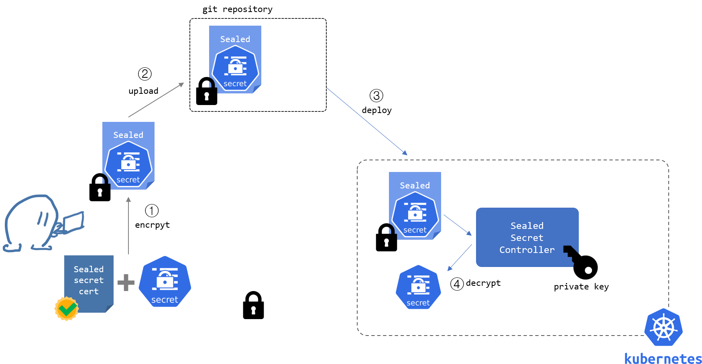

## SealedSecret Controller
https://github.com/bitnami-labs/sealed-secrets

We must have some Credentials on Kubernetes (like Github SSH-Key, and so on). These secrets we are not allowed to push to Git. So we need an mechanismn encrypt data.
SealedSecret works with an encrypten key on kubernetes cluster. each cluster has it's own key with keyrotation. for every new cluster the sealedsecret has to be encrypted again. 
```bash
kubectl apply -f https://github.com/bitnami-labs/sealed-secrets/releases/download/v0.24.1/controller.yaml
kubectl get pods -n kube-system -l name=sealed-secrets-controller

# Installing kubeseal-CLI Tool
KUBESEAL_VERSION='0.24.1'
wget "https://github.com/bitnami-labs/sealed-secrets/releases/download/v${KUBESEAL_VERSION:?}/kubeseal-${KUBESEAL_VERSION:?}-linux-amd64.tar.gz"
tar -xvzf kubeseal-${KUBESEAL_VERSION:?}-linux-amd64.tar.gz kubeseal
sudo install -m 755 kubeseal /usr/local/bin/kubeseal
rm -r kubeseal
rm -r kubeseal-${KUBESEAL_VERSION:?}-linux-amd64.tar.gz

# testing to encrypt a Secret
kubectl create secret generic gitlab-access-token -n default \
--from-literal=token=[YOUR_GITLAB_ACCESS_TOKEN]

kubectl get secret gitlab-access-token -o yaml |kubectl-neat > secret_gitlab-access-token.yaml

kubeseal --format yaml < secret_gitlab-access-token.yaml > base/secrets/sealedsecret_gitlab-access-token.yaml
```
#### Example

Only with the master Key on the Cluster, you can decrypt the token.

```yaml
apiVersion: bitnami.com/v1alpha1
kind: SealedSecret
metadata:
  creationTimestamp: null
  name: gitlab-access-token
  namespace: default
spec:
  encryptedData:
    token: AgAm4ox/ArvJPwMBEr7/+SNU8oAP2KjUYwPsOmaFmJ3f+AQBgXo1TO2J3FEkZqfF9MYsaIECMzkRXNypb1vN7pMjrGU5IQ7JgGnW9YMCv7bkSagyPhXUKGC5BMURoM16Xg7hebfSsQ6p3n5JOAlGTYZcPVs8kIUjKnQ/kQ9+KPJtwlL17PiFgtbHZLe9IQktHZjuvmRySVy6NlKYuequd3hvzWIj1HfTgr55mrP7bnpeBw7atnrH7brp0JFMem7rfS9L+8HVfpqYJblyvV0UFTpf+2eOMip++6JGtGLJVJpzGj781XfSAzDmxXKloC89LKFRbFTHKN9QGjwzLZKb6cs3Euuegjtpn0a3AVAfk6a9VWCrrakGUTT4LvytQLDrHFGuTki0TJwKq6DL3NuYhA/O8XZnDsqniKCcR/hmBHRQtrB0kaD4hBxr0I5fgEXD0/5LR1aa9Izm5xJgq2mwfcS/PaFqjIfkvZQ51UPlKMe3sGxjaty5WoDGmhkHFuH01VHCqOTLi3vUzLCVZ2gGsJwdXTsXdRVMMLgpj1hYJBbHJyKw8/Br6bQmf4D3OrrYu6aWR6ifWCYuj4Ot97vtO7BgZoH21roLnPL6CTOLXBww06P2v7uMhqXM8Tng+1AwVn0WOqiIAEOQj5qPGvDj+cyzWxifWgu3KHurAmt9RHqRW8ZCHG7UU8eGQkQ5dETf80NnutTtM9weAO7vwYEGSvMHFhA+qGwcSFOSuw==
  template:
    metadata:
      creationTimestamp: null
      name: gitlab-access-token
      namespace: default
    type: Opaque

```


### Details - those who are intereted
